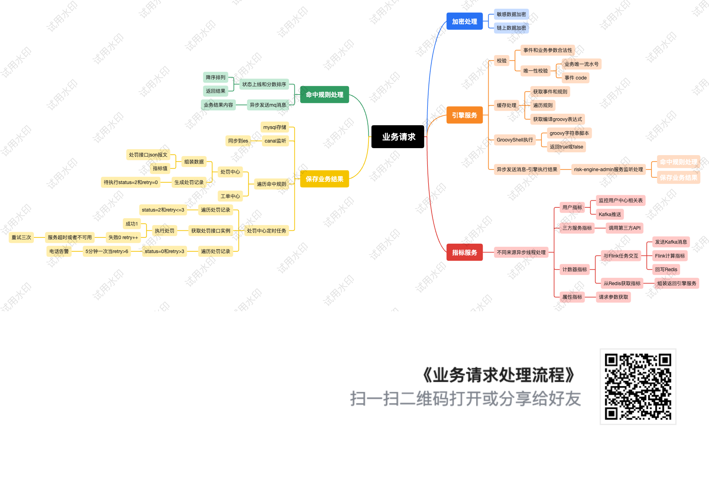

# risk-engine-x

**risk-engine-x** 是一个基于 Java 的实时风控引擎，旨在提供高效、可扩展的风控解决方案。  
该项目结合了作者在信贷风控和币圈交易所风控领域的多年经验，融合了链上数据分析、实时监控、智能告警、量化交易等功能，适用于反欺诈、信用评估、风险决策等多种场景。

---

## 📌 项目背景

随着区块链技术的发展和数字资产的普及，交易所作为币圈的重要载体，承载着众多用户的交易需求。  
为了有效监控链上数据、识别潜在风险、保障交易安全，开发一个高效的风控引擎显得尤为重要。  
本项目旨在通过分析链上数据（如筹码分布、活跃地址、聪明钱地址的盈利能力等）， 交易所K线数据分析（对交易指标RSI、KDJ、MACD、BOLL、MA、EMA量化分析），币圈新闻实时抓取和推送等事件，实现对市场行情的实时监控和风险预警，后续还可以拓展优化升级迭代。

---

## 🧩 功能模块

本项目采用模块化设计，主要包括以下子模块：

- `risk-engine-crawler`：爬虫模块，用于抓取链上信息。
- `risk-engine-components`: 中间件模块，用于es、mq。
- `risk-control-analysis`：分析模块，负责清洗和分析爬虫数据。
- `risk-engine-common`：公共模块，包含项目通用的工具类和配置。
- `risk-engine-service`：业务模块，处理核心业务逻辑。
- `risk-engine-db`：数据访问模块，负责数据库的持久化操作。
- `risk-engine-metric`：特征服务模块，用于计算各类特征值。
- `risk-engine-rest`：RESTFUL 接口服务，提供对外的 API 服务。
- `risk-engine-job`：任务调度服务，处理消息消费和定时任务。

---

## 🚀 快速开始

### ✅ 环境要求

- Java 11 或更高版本
- Maven 3.9 或更高版本
- Docker docker部署xxl-job-admin、 xxl-job-executor、redis6.0、mysql8.0、jdk11、kibana-7.17.4、elasticsearch-7.17.4、apache/rocketmq:4.9.4
- Ubuntu22.04-Docker26
- CPU - 2核 内存 - 4GB
  系统盘 - SSD云硬盘 60GB
  流量包 - 1536GB/月（峰值带宽 30Mbps）

### 🔧 克隆项目

bash
```
git clone https://github.com/ixiaoku/risk-engine-x.git
cd risk-engine-x
```

🔨 构建项目

`mvn clean install -DskipTests`

▶️ 运行服务

目前是通过配置推送到github的action打包编译生成docker镜像，推送到docket hub
然后在服务器拉取最新镜像，启动服务

## 服务器启动脚本
```
#!/bin/bash

cd /opt/risk-engine-x

echo "Disk usage before deployment:"
df -h

echo "Stopping services..."
docker-compose down

echo "Removing old images..."
docker rmi bbxydcr22/risk-engine-x:risk-engine-admin-ui-latest || true
docker rmi bbxydcr22/risk-engine-x:risk-engine-rest-latest || true
docker rmi bbxydcr22/risk-engine-x:risk-engine-job-latest || true

echo "Pulling latest images..."
docker pull bbxydcr22/risk-engine-x:risk-engine-admin-ui-latest
docker pull bbxydcr22/risk-engine-x:risk-engine-rest-latest
docker pull bbxydcr22/risk-engine-x:risk-engine-job-latest

echo "Redeploying services..."
docker-compose up -d

echo "Disk usage after deployment:"
df -h

echo "Deployment completed!"
```
您可以根据需要启动其他模块，如 risk-engine-job等。

⸻

### sql脚本目录
- ./risk-engine-db/src/main/resources/db.sql

🧱 架构图



⸻

📍 使用示例

以下是一个使用 RESTFUL 接口进行风险评估的示例：
```
curl -X POST http://localhost:8088/api/risk/engine \
-H "Content-Type: application/json" \
-d '{
"flowNo": "BTCUSDT1744306200000",
"incidentCode": "TradeQuantData",
"requestPayload": "{\"announcement\":{\"content\":\"5min内，币种交易对：BTCUSDT, 开盘价: 79182.00000000, 收盘价：79238.20000000, 涨跌幅：0.07\",\"createdAt\":\"2025-04-11 01:44:59\",\"title\":\"涨跌幅提醒\"},\"close\":79238.20000000,\"closeTime\":1744307099999,\"downChangePercent\":0,\"high\":79441.39000000,\"interval\":\"15m\",\"low\":79055.25000000,\"open\":79182.00000000,\"openTime\":1744306200000,\"quoteVolume\":22141752.22314620,\"symbol\":\"BTCUSDT\",\"takerBuyQuoteVolume\":10012098.84158940,\"takerBuyVolume\":126.31532000,\"tradeCount\":56258,\"upChangePercent\":0.07,\"volume\":279.40449000}"
}'

```
响应示例：
```
{
    "decisionResult": "1"//1通过 0拒绝
}
```


⸻

🤝 贡献指南

欢迎对本项目感兴趣的开发者提出建议、报告问题或提交代码。请参考以下步骤参与贡献：
-	Fork 本仓库
-	创建您的特性分支：git checkout -b feature/YourFeature
-	提交您的更改：git commit -m 'Add YourFeature'
-	推送到分支：git push origin feature/YourFeature
-	创建一个新的 Pull Request

在提交代码前，请确保遵循项目的代码规范，并通过所有测试用例。

⸻

📄 许可证

本项目采用 Apache License 2.0 许可证。
您可以自由地使用、修改和分发本项目的代码，但请保留原始许可证声明。

⸻

📬 联系方式

如果您有任何问题或建议，欢迎通过以下方式与我联系： 
- GitHub Issues: https://github.com/ixiaoku/risk-engine-x/issues
- 邮件: djm88dcr@gmail.com

---